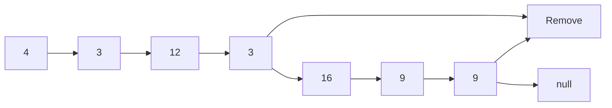
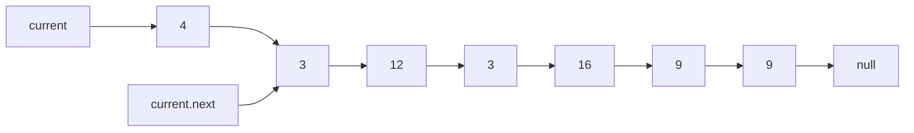

# remove-duplicates-from-a-linked-list

## Problem Domain

Make a function that removes duplicates values from a linked list.

## EXAMPLE DATA

Head starts at 4

## input: 4 --> 3 --> 12 --> 3 --> 16 --> 9 --> 9

## output: 4 --> 3 --> 12 --> 16 --> 9


### Removes duplicates



### What is current


### What is current & current.next




```