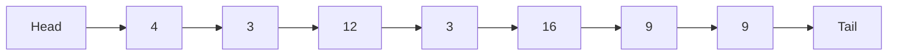
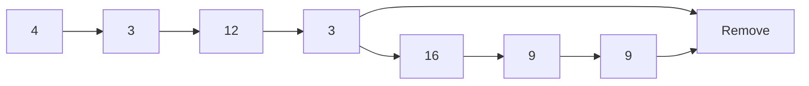
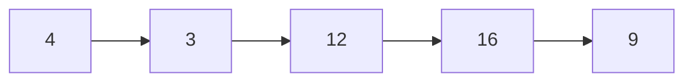
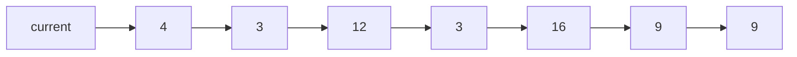
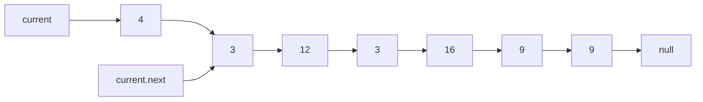

# remove-duplicates-from-a-linked-list

## Problem Domain

Make a function that removes duplicates values from a linked list.

## EXAMPLE DATA

Head starts at 4

## input: 4 --> 3 --> 12 --> 3 --> 16 --> 9 --> 9

## output: 4 --> 3 --> 12 --> 16 --> 9

## Head represents 4 & Tail represents 9



## Removes duplicates



## What it looks like after duplicates are removed



## What is current? Current is the Node you are on at the moment. Which right now is the starting Node with the data of 4.



## What is current.next? current.next represents the next Node in the sequence.



## This is where you Traverse the list till the last node

```mermaid
    flowchart LR
   current --> A[4] --> B[3] --> current.next
    A --> C[12] --> current.next
    A --> D[3]  --> current.next
    A --> E[16] --> current.next
    A --> F[9] --> current.next
    A --> G[9] --> current.next
   ```

## Algorithm

Traverse the list from the head (start) node

while Traversing check if value in the node is present in any other node 

if it is present the remove it from list.

if not in list then go to next and keep checking nodes.

when all node been checked and removed then end program.

## Code

```js
   /* Linked list Node*/
    class Node
    {
        constructor(data) {
            this.data = data;
            this.next = null;
          }
    }

  class LinkedList {
  constructor() {
    this.head = null;
  }

    
let head = new Node(); 
function removeDuplicate(head) {

  /* Reference to head*/
  let current = head;

  // this is where you Traverse the list till the last node

  while (current != null) {
    let tempStore = current;

  /* This is where we compare the current node with the next node and keep on deleting them until it matches the current node data */

    while (tempStore != null && tempStore.data == current.data) {
        tempStore = tempStore.next;
    }

    /* Then you have to set current node next to the next different element denoted by tempStore*/

    current.next = tempStore;
    current = current.next;
  }
}

   /* Puts a new Node at the front of the list. */
    function push(newData)
    {
        /* Assigns the Node, and puts in the data*/
        let newNode = new Node(newData);
    
        /* Makes next of new Node as the head */
        newNode.next = head;
    
        /* This moves the head to point to new Node */
        head = newNode;
    }
```

## Test

```js

const LinkedList = require('file');


describe('testing the Linked List data structure', () => {

  test('Where it removes Duplicate from the LinkList', () => {
    let list = new LinkedList;
    list.push(4);
    list.push(3);
    list.push(12);
    list.push(3);
    list.push(16);
    list.push(9);
    list.push(9);
    expect(list.push(5)).toEqual('4, 3, 12, 16, 9');
  });
}
input: 4 --> 3 --> 12 --> 3 --> 16 --> 9 --> 9
output: 4 --> 3 --> 12 --> 16 --> 9
```

## Big O

Time: O(n)
Space: O(1)
