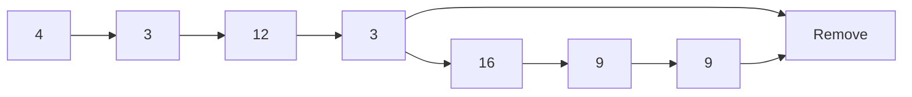
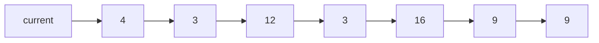
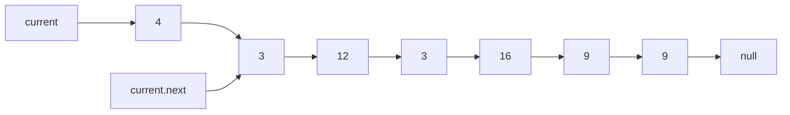

# remove-duplicates-from-a-linked-list

## Problem Domain

Make a function that removes duplicates values from a linked list.

## EXAMPLE DATA

Head starts at 4

## input: 4 --> 3 --> 12 --> 3 --> 16 --> 9 --> 9

## output: 4 --> 3 --> 12 --> 16 --> 9

```mermaid
graph LR
                
    Head --o A[4] --> B[3]
    B --> C[12]
    C --> D[3]
    D --> E[16]
    E --> F[9]
    F --> G[9] --0 Tail
   
```

### Removes duplicates



### What is current



### What is current & current.next



## Algorithm

Traverse the list from the head (start) node

while Traversing check if value in the node is present in any other node 

if it is present the remove it from list.

if not in list then go to next and keep checking nodes.

when all node been checked and removed then end program.

