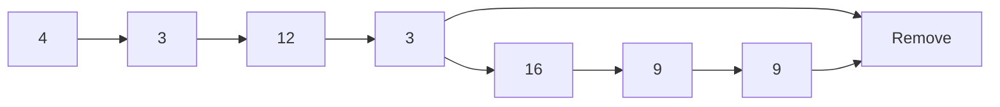
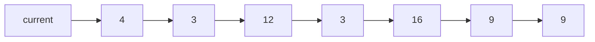
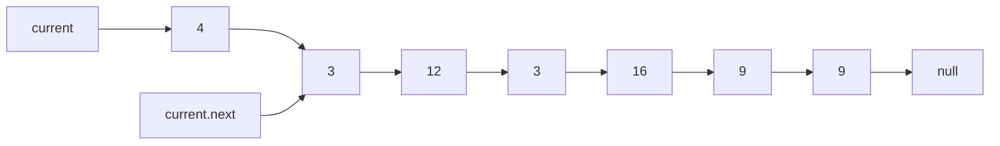

# remove-duplicates-from-a-linked-list

## Problem Domain

Make a function that removes duplicates values from a linked list.

## EXAMPLE DATA

Head starts at 4

## input: 4 --> 3 --> 12 --> 3 --> 16 --> 9 --> 9

## output: 4 --> 3 --> 12 --> 16 --> 9

## Head represents 4 & Tail represents 9


### Removes duplicates



### What is current



### What is current & current.next


```mermaid
    graph LR
    A[4] --> B[3]
    A --> C[12]
    A --> D[3] 
    A --> E[16]
    A --> F[9]
    A --> G[9] 
   ```

## Algorithm

Traverse the list from the head (start) node

while Traversing check if value in the node is present in any other node 

if it is present the remove it from list.

if not in list then go to next and keep checking nodes.

when all node been checked and removed then end program.

## Code

```js
// head of the list

let head = newNode();

function removeDuplicate() {

  // Reference to head again
  let current = head;

  // this is where you Traverse the list till the last node

  while (current != null) {
    let tempStore = current;

  /* This is where we compare the current node with the next node and keep on deleting them until it matches the current node data */

    while (tempStore != null && tempStore.data == current.data) {
        tempStore = tempStore.next;
    }

    /* Then you have to set current node next to the next different element denoted by tempStore*/

    current.next = tempStore;
    current = current.next;
  }
}
```

## Big O
Time: O(n)
Space: O(n)
